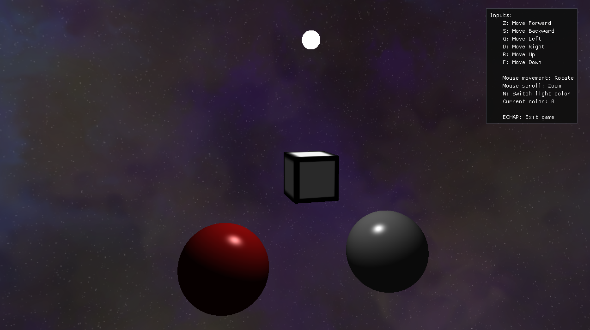

# OpenGL Scene

## C++ classes

- ### Game

   - Handles OpenGL initialization
   - Stores camera, shaders, file paths
   - Implements OpenGL callback functions
   - Implements scene core methods
 
- ### Shader

    - Convert shader code from file to OpenGL Shaders
    - Stores shader id for mesh drawing
    - Implements methods to modify shader variables

- ### Camera

    - Stores camera data (position, rotation, ...)
    - Implements keyboard inputs methods
    - Can return view matrix
    - Handles ImGui HUD content

- ### Mesh

   - Implements Vertex, Texture and Material structures
   - Stores vertices, indices and texture / material data
   - Calls OpenGL drawing methods with mesh data
   - Draws mesh based on textures or materials, sets its position, rotation and scale
   - Adds methods to read texture from image and to load cubemap texture

- ### Cube & Sphere

    - Derived from Mesh, constructors fill vertices and indices with cube and sphere data

## Scene

Both red and grey spheres have a material and are drawn with the *material shader*.  
The cube has a texture stored in data/textures and is drawn with the *texture shader*.  
The top sphere is the light source. It has a texture and is drown with the *light source shader*.

You can change the light color by pressing N. It cycles between white, red and green light. 

| Red                                                      | Green                                                      |
|----------------------------------------------------------|------------------------------------------------------------|
|  |  |

